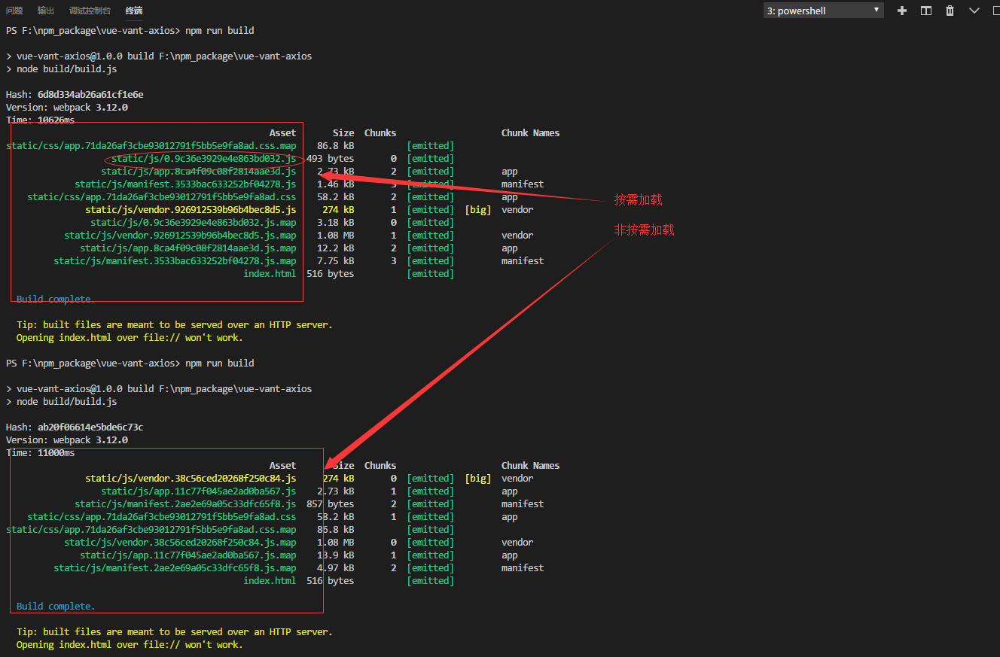

# vue-vant-axios

## 技术栈

* vue
* vue-router 路由
* vant ui 库
* axios ajax 库
* scss css 预处理器

## 项目文件架构说明

```js
|vue-vant-axios
    |——src 源码文件
      |——assets 公共资源
      |——components 公共组件
      |——router 路由
      |——views 逻辑页面
          |——home 首页
            |——index.vue 模板
            |——styles.scss 样式 可选
            |——images 图片 可选
            |——swipe
              |——index.vue
              |——style.scss
              |——images
          |——mime 主页
            |——index.vue
            |——style.scss
            |——images
```

## v0.0.1

* 搭建 vue-vant-axios 项目，使用 vue-template-webpack 模板

## v1.0.0

* 安装插件 vant

```js
// ./src/main.js
import Vant from 'vant';
import 'vant/lib/vant-css/index.css';
Vue.use(Vant);
```

* 引入移动端适配方案 rem

```js
// ./src/main.js
import './assets/rem'; // ./src/assets/rem.js
```

* 删除无用文件 HolleWord.vue 等
* 新增页面 views/home views 包含所有的逻辑页面

```js
|——src
  |——views
    |——home
      |——index.vue
      |——style.scss
```

* 使用 css 处理器 scss

  安装依赖 style-loader css-loader sass-loader node-sass

  $ npm install style-loader css-loader sass-loader node-sass --save-dev

  这里需要注意的是，有可能 node-sass 安装失败，这时候用淘宝的 cnpm 安装就能解决这个问题

  即

  $ cnpm install node-sass --save-dev

  如果报以下错误

  

  解决办法是，删除 node_modules package-lock.json，并重新安装依赖

  npm install

* 路由按需加载

```js
// ./src/router/index.js
import Vue from 'vue';
import Router from 'vue-router';
import _import from './_import'; // ./src/router/_import.js

Vue.use(Router);

export default new Router({
  routes: [
    {
      path: '/',
      name: 'Home',
      component: _import('home')
    }
  ]
});
```

结果对比



* babel-polyfill

1. 安装

$ npm install babel-polyfill --save

2. 引入

```js
// ./build/webpack.base.conf.js
  entry: {
    app: ['babel-polyfill','./src/main.js'],
  },
```

* px 转 rem

1. 安装

$ npm install postcss-pxtorem --save-dev

2. 引入

```js
// ./.postcssrc.js
"plugins": {
  // to edit target browsers: use "browserslist" field in package.json
  'autoprefixer': {
    browsers: ['Android >= 4.0', 'iOS >= 7']
  },
  'postcss-pxtorem': {
    rootValue: 37.5,
    propList: ['*']
  }
}
```

## v1.1.0

* 封装 axios，设置默认参数并能在this中使用
```js
// ./src/assets/js/createRequest
import axios from 'axios';
/**
 * 前后端请求
 *
 * @export
 * @param {any} URL 地址
 * @param {any} params 参数
 * @returns
 */
export default function createRequestHttp (URL, params) {
  return new Promise(function (resolve, reject) {
    let instance = axios.create();
    instance.defaults.baseURL = window.CONFIG.baseURL;
    instance.defaults.headers.post['Content-Type'] = 'application/x-www-form-urlencoded';
    instance.defaults.withCredentials = true;
    instance.defaults.transformRequest = [
      function (data) {
        let newData = [];
        for (let k in data) {
          newData.push(encodeURIComponent(k) + '=' + encodeURIComponent(data[k]));
        }
        return newData.join('&');
      }
    ];
    instance.defaults.transformResponse = [
      function (res) {
        res = JSON.parse(res);
        if (res.state !== 1) {
          throw Error('请求失败');
        }
        return res.data;
      }
    ];
    instance.post(URL, params)
      .then(res => {
        resolve(res);
      }).catch(err => {
        reject(err);
      });
  });
}

// ./main.js
import createRequestHttp from '@/assets/js/createRequest';
Vue.prototype.$createRequestHttp = createRequestHttp;
```

## 也许这些对您有帮助

* css 文件引入

  当我们要引入不是其本文件跟目录下的 css 文件时，记得使用 '~@文件名' 来简化 './../../....'这些相对路径

```js
@import './../../../assets/css/mixin.scss';
//简化成功
@import '~@/assets/css/mixin.scss';
```

* css常用相同模块内容可以提mixin提供多处使用，如：
```css
//省略号
@mixin omit{
  overflow: hidden;
  text-overflow: ellipsis;
  white-space: nowrap;
}
//清除浮动
@mixin clearfix{
  zoom: 1;
  &:after {
    content: ".";
    display: block;
    height: 0;
    clear: both;
    visibility: hidden
  }
}
```

* 标题或者其他个性化的内容并且每个页面都会用到的内容可以在 router 路由的 mate 属性中设置，如：

```js
{
  path: '/home',
  name: 'Home',
  component: _import('home'),
  meta: {
    title: '首页'//标题
  }
},
{
  path: '/mime',
  name: 'Mime',
  component: _import('mime'),
  meta: {
    title: '个人中心'
  }
}
```
