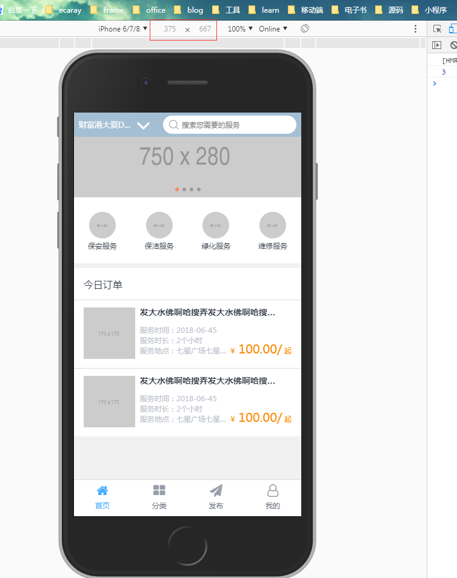

# rem 在移动端实战

本项目采用 iPhone 6 物理像素为 750px \* 1334px 的设计稿

## rem 适配原理

关于 rem 适配这里不过多讲述，因为我们主要是讲解 rem 实战，再者是讲 rem 方法论的文章实在太多了，咱们时间有限只能是专挑重要的说。

> 什么是 rem 布局：

    指元素相对根元素html的font-size，按照等比例缩放元素大小。

咱们还是拿本项目做讲解：

项目中统一设置 rem 和 px 的比例为：

> px : rem = 37.5 : 1

好了，既然知道 rem 是相对根元素 html 布局的，现在我们要做的事情就是，如何通过一种方法来实现不同的手机屏幕显示不同的根元素大小。

## 几个概念

1. 机型的设备像素比 devicePixelRatio：
   > 所谓设备像素比其实就是：设备上物理像素和设备独立像素(device-independent pixels (dips))的比例。

公式表示就是：window.devicePixelRatio = 物理像素 / dips，

2. 设备独立像素：
   > 与设备无关的逻辑像素，代表可以通过程序控制使用的虚拟像素，是一个总体概念，包括了 CSS 像素。比如上面设计稿中的 iPhone 6 的设备独立像素就是 375 \* 667



3. 机型的设备独立像素可以通过 document.documentElement.clientWidth 来获取

所以上面的 37.5 其实就是用 iPhone 6 的设备独立像素 375 除以 10 得到的，当然这里您直接用别的比例也是可以的。

## 实现 rem 转 px

```js
var docEl = document.documentElement;
var rem = docEl.clientWidth / 10;
docEl.style.fontSize = rem + 'px';
```

具体实现可以看

```js
// ./src/assets/js/screen-adaptation.js
```

当然我们不能每次设置元素的时候，都要自己去算一下，这样就显得 low 了，所以本项目主要使用了一下方法来实现：

## 使用

1. 下载[postcss-pxtorem](https://github.com/cuth/postcss-pxtorem)
2. 配置.postcssrc.js
```js
// ./.postcssrc.js

'postcss-pxtorem': {
  rootValue: 37.5,
  propList: ['*']
}
```
3. 设计稿和设备独立像素计算
```scss
/* ./src/assets/css/function.scss */
@function half($num) {
  @return ($num);
}
```

只要在使用的时候直接写上设计稿大小即可，比如：元素 div 的宽为 100px，即：

```css
div {
  widht: half(100px);
}
```
